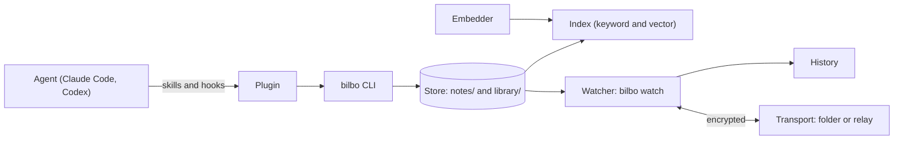

# Concepts

This page explains the moving parts of bilbo and how they fit together, so the
guides make sense. Each part links to the guide that shows how to use it.

bilbo is durable memory for coding agents: notes an agent writes in one session
and finds again in the next, and a library of sources it can cite. Agents are
the main readers and writers of the store; you install and configure it, and can
read, edit and grep the files yourself.

## Store

The store is where notes and sources live: plain Markdown files with YAML
frontmatter, in `<root>/notes/` and `<root>/library/`. Where the root is:
[Folders](reference/configuration.md#folders). You can read, edit, grep and
version the files like any others. `bilbo check` lints the whole store and
changes nothing.

See [Files](reference/files.md).

## Note and kind

A note is an authored Markdown file on one topic, named `<kind>-<topic>.md`. The
kind is its type: one of `plan`, `spec`, `design`, `decision`, `gotcha`,
`research`, `review`, `report` or `reference`. A topic has at most one note,
whatever its kind.

See [Files](reference/files.md#note-format) and [Agents](guides/agents.md).

## Index and embedder

The index is a search index, keyword and vector, derived from the store: `bilbo
recall` reads it, and `bilbo index` rebuilds the vector part. The embedder is
the external service that turns text into vectors. Without one, bilbo is
keyword-only. A timer keeps the index current.

See [Embedders](guides/embedders.md).

## Digest

The digest is the short list of relevant notes that a hook injects into a
prompt, so the agent starts with what an earlier session already worked out.

See [The digest](guides/agents.md#the-digest).

## Library

A source is fetched text kept verbatim. A corpus is a folder of sources on one
subject, with its guide. The library is the set of sources. A citation is a
reference from an answer to a passage in a note or a source, and `bilbo cite`
checks it, so the coverage an agent reports is counted by bilbo.

See [Library](guides/library.md) and [Citations](guides/library.md#citations).

## History

The watcher records each version of a note as an agent or an editor changes it,
so a careless rewrite is one `bilbo restore` away from undone.

See [History](guides/history.md).

## Scope

A scope is a named part of your notes, declared per device in the config. A
scope decides which notes sync, which embedder may see them and, through its
`paths`, which scope a note created under a folder gets.

See [Scopes](guides/scopes.md).

## Device, owner and manifest

A device is one machine's copy of bilbo, with its own key. The owner is you: one
identity that every device of yours shares. The manifest is the signed record of
which devices may read a syncing scope.

See [Devices](guides/devices.md) and [Security](security.md).

## Sync, transport and relay

Notes in a scope sync between one owner's devices, end-to-end encrypted. The
transport is where a scope syncs: a `file://` folder or a relay. The relay is
the `bilbo relay` server, a transport over `https://` that you run on a machine
you control.

See [Sync](guides/sync.md) and [Relay](guides/relay.md).

## Plugin

The plugin gives Claude Code and Codex four skills (`note`, `recall`,
`reference`, `ingest`), the digest hook and a compaction hook. `bilbo setup`
installs it, along with the index timer and the watcher service.

See [Agents](guides/agents.md) and [Set up](guides/setup.md).

## See also

- [Getting started](getting-started.md)
- [Commands](reference/commands.md)
